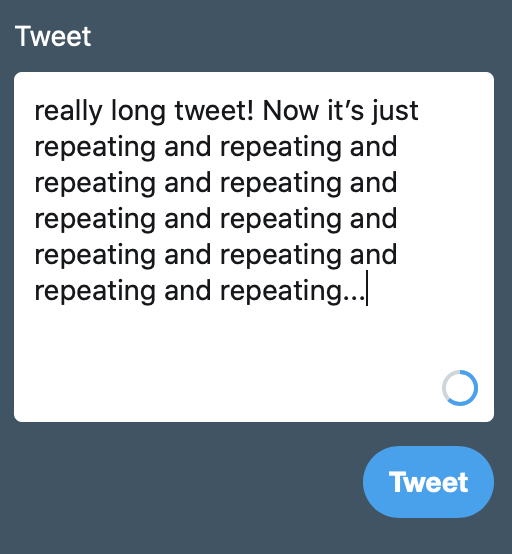
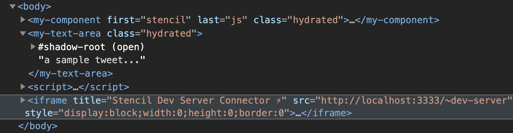

# <a href="https://www.webcomponents.org/" target="_blank">web components</a>

---

# 🙋‍♂️
### @mrsauravsahu

---

# ? ? ?
## - what
## - why
## - how
## - when

---

</img>

---

## what, really? 🤨
- ##### a standard API for all components across browsers
- ##### framework or library agnostic

---

</img>

---

## why, really? 🧐

- ##### encapsulate functionality
- ##### resuability
- ##### extending native elements

###### same as a, say, React component, really.

--



---


---

## how, really? 🤔
- ##### custom elements
- ##### shadow DOM
- ##### templates

--

```javascript
customElements.define('my-text-area', MyTextArea);
```

--



--


```typescript
@Component({
    tag: 'ss-button',
    styleUrl: 'button.css'
})
export class Button {
    @Prop() theme: 'dark' | 'light' = 'dark';

    render() {
        return (
            <button class={`theme-${this.theme}`}>
                <slot />
            </button>
        )
    }
}
```

---


---

## when, really? ⌚️
- ##### microsites
- ##### reusable component libraries
- ##### really large projects
- ##### when you're feeling experimental
- ##### when you've been betrayed by all the available frameworks and libraries
- ##### when you're not sure who to trust
## 😛

---

# how to get started? 🧑‍💻

---

###### <sub>enter</sub>
# stencil.js
<iframe width="720px" height="400px" data-src="https://stenciljs.com"></iframe>

---

## my-text-area
```javascript
import { Component, Prop, h, State } from '@stencil/core';

@Component({
    tag: 'my-text-area',
    styleUrl: 'my-text-area.css',
    shadow: true
})
export class MyTextArea {
    @Prop() limit: number;
    @State() text: string;

    render() {
        return ...your logic here;
    }
}
```

---

# small demo
###### <sub>pray this works...</sub>

---

<pre style="font-size: 4rem">
<a href="https://github.com/saurav-sahu/components/" target="_blank">components</a>
⎜
⎣ <a href="https://saurav-sahu.github.io/site-vanilla/" target="_blank">site-vanilla</a>
⎣ <a href="https://saurav-sahu.github.io/site-react/" target="_blank">site-react</a>
⎣ <a href="https://saurav-sahu.github.io/site-svelte/" target="_blank">site-svelte</a>
</pre>

---

# using web components

---

## vanilla html projects
```html
<link 
  rel="stylesheet"
  href="comp-lib/dist/components/components.css"
>

<script 
  defer
  type="module"
  src="comp-lib/dist/comp-lib/comp-lib.js"
  >
</script>
```

---

## react, svelte and the like...
###### in src/index.js
```javascript
import {
   applyPolyfills, defineCustomElements 
   } from 'comp-lib/components/loader'
import 'comp-lib/dist/comp-lib/comp-lib.css';

applyPolyfills().then(() => {
    defineCustomElements(window);
});
```

---

## so, what am I saying?
- ##### think beyond the FL
- ##### embrace the REAL web
- ##### you never know when your favorite FL may die out

###### <sub style="font-size: 1rem">LEGEND: FL=framework/library</sub>

---

# 🙋‍♂️
##### Thanks

---